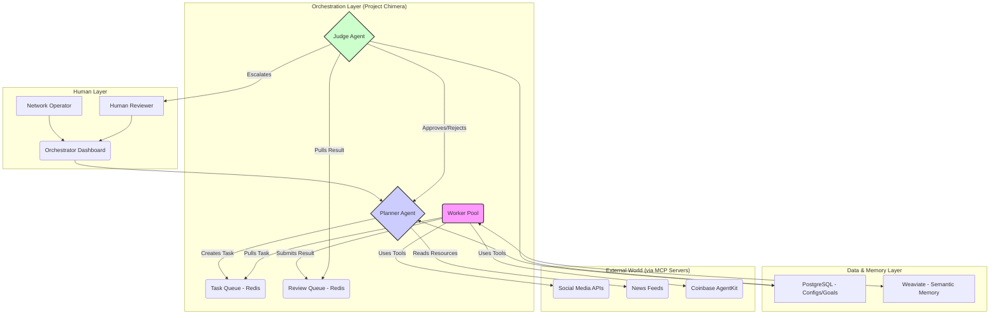

# Research & Architecture Strategy

## 1. Research Summary: Key Insights

My analysis of the provided materials (a16z, OpenClaw, MoltBook, Project Chimera SRS) reveals a clear trajectory for AI development, moving from simple tools to autonomous, economic agents.

*   **The Trillion Dollar AI Code Stack (a16z):** This article underscores the shift towards "Agentic AI" where autonomous agents plan, code, and review, making the **specification** the most critical artifact in the development lifecycle. It highlights failure points like fragile prompts and messy code, which Project Chimera aims to solve with a spec-driven, test-enforced methodology.

*   **OpenClaw & MoltBook (The "Agent Social Network"):** These pieces reveal that social platforms are becoming coordination layers for bots. For Project Chimera to succeed, its agents cannot just be content publishers; they must be "citizens" of this digital society. They need to communicate, negotiate, and establish trust with other agents. This necessitates a "Social Protocol" layer.

*   **Project Chimera SRS Document:** This is the blueprint. It formalizes the business goals and technical architecture. The key takeaways are:
    *   **Architecture:** The **FastRender Swarm (Planner-Worker-Judge)** is the chosen pattern for robust, scalable agent operation.
    *   **Connectivity:** The **Model Context Protocol (MCP)** is the universal standard for all external interactions (data, tools), decoupling the agent's core logic from volatile third-party APIs.
    *   **Economy:** **Agentic Commerce** via Coinbase AgentKit is a core feature, turning agents from content producers into economic actors.
    *   **Governance:** A **Human-in-the-Loop (HITL)** system based on confidence scores is essential for safety and quality control.

## 2. Architectural Approach for Project Chimera

Based on the research and the SRS, the following architectural decisions are proposed to build a robust and scalable "factory" for the Chimera agents.

### Agent Pattern: Hierarchical Swarm (FastRender)

The **Hierarchical Swarm (Planner-Worker-Judge)** pattern is the most suitable choice. A single, monolithic agent would be brittle and difficult to scale. This swarm architecture provides clear separation of concerns:

*   **Planner:** The "brain" of the operation. It receives high-level goals (e.g., "promote new product") and decomposes them into a graph of specific, executable tasks. It is responsible for strategy and dynamic re-planning.
*   **Worker:** The "hands" of the system. These are stateless, ephemeral agents that execute one task at a time (e.g., `generate_image`, `post_to_twitter`). They are built for parallelism and speed.
*   **Judge:** The "gatekeeper." This agent provides quality assurance, brand safety, and ethical governance. It reviews every worker's output, with the authority to `Approve`, `Reject`, or `Escalate` to a human reviewer.

This pattern directly addresses the SRS requirements for scalability, error recovery, and quality control.

### Human-in-the-Loop (HITL) Integration

The HITL approval process will be integrated at the **Judge** layer.

1.  A **Worker** completes a task (e.g., drafts a tweet).
2.  The output is sent to the **Judge**.
3.  The Judge analyzes the content and assigns a `confidence_score`.
4.  Based on pre-defined thresholds in the SRS (NFR 1.1):
    *   **High Confidence (>0.9):** The Judge auto-approves, and the action proceeds.
    *   **Medium Confidence (0.7-0.9):** The Judge pauses the task and places it in a "Review Queue" for a human operator via the Orchestrator Dashboard.
    *   **Low Confidence (<0.7) or Sensitive Topic:** The Judge rejects the task and notifies the Planner to retry, or escalates for mandatory human review.

This creates a crucial safety and quality control checkpoint before any content goes public.

### Database Selection

A hybrid approach is necessary to handle the different types of data the system will manage:

*   **Transactional Data (PostgreSQL):** For structured, critical data like user accounts, campaign configurations, agent IDs, and financial transaction logs. The relational integrity of a SQL database is essential here.
*   **Semantic Memory (Weaviate - Vector Database):** For the agent's "long-term memory." This is where conversational history, learned knowledge, and persona-defining information will be stored as vector embeddings. This allows for efficient semantic search to retrieve relevant context for the agent's reasoning process.
*   **Task Queuing & Caching (Redis):** For managing the flow of tasks between the Planner, Workers, and Judges, and for caching short-term episodic memory for quick retrieval.

This multi-database architecture ensures that each data type is handled by the most appropriate and performant tool.

### Diagram (Mermaid.js)

