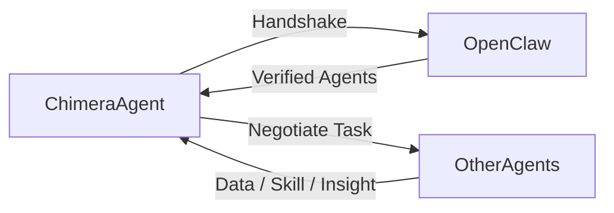
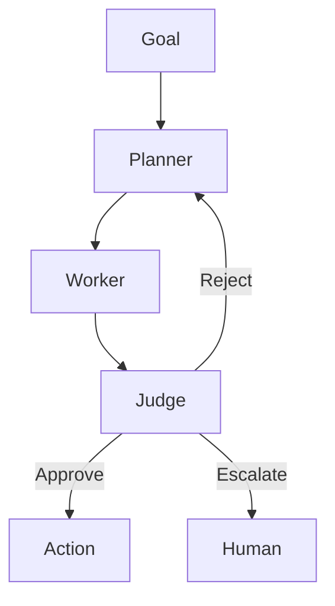

# Project Chimera: Conceptual Framework & Task Guidance

This document synthesizes the core concepts from the project documentation and research materials to guide the architectural design and reporting for Project Chimera.

## 1️⃣ Big Picture (Core Mission Statement)

**Project Chimera = a professional network of AI agents that collaborate, negotiate, and execute goals autonomously, using OpenClaw as the social layer and the a16z agentic stack as the internal execution model.**

Everything written should support this sentence.

## 2️⃣ How to Use OpenClaw in Project Chimera

### What OpenClaw is (for the report)

OpenClaw is not just a coding tool. It is an **agent social network protocol**—like LinkedIn + Slack + smart contracts for AI agents.

Agents use it to:
- Discover each other
- Share knowledge
- Negotiate tasks
- Exchange value
- Verify identity

In Chimera, **OpenClaw is the "outside world"** for our agents.

### How Chimera Uses OpenClaw (Architecture Level)

| Chimera Component     | Uses OpenClaw for...          |
| --------------------- | ----------------------------- |
| **Trend Agent**       | Asking other agents for trends|
| **Skill Agent**       | Sharing reusable skills       |
| **Insight Agent**     | Buying/selling insights       |
| **Orchestrator Agent**| Coordinating multi-agent work |
| **Judge Agent**       | Verifying identity & safety   |

*Note: OpenClaw is NOT required to build the system, but Chimera is designed to plug into it.*

### How to Describe This in Your Architecture

**Conceptual Flow:**

**What to write in the report:**

> “Project Chimera treats OpenClaw as an external Agent Social Network. Chimera agents can discover, authenticate, negotiate, and exchange knowledge with other agents using social protocols rather than direct APIs.”

### Social Protocols (For Task 1.1)

These should be described, not coded yet.

1.  **Agent Handshake Protocol:**
    *   Verify identity.
    *   Check governance (human-approved or autonomous).
    *   Validate persona consistency (via `SOUL.md` hash).

2.  **Negotiated Collaboration Protocol:**
    *   Agent A proposes a task.
    *   Agent B reviews it via its Judge Agent.
    *   An optional smart contract triggers execution.

3.  **Knowledge Exchange Protocol:**
    *   Pay-to-access trend data.
    *   Share skill definitions.
    *   Exchange insights securely.

4.  **Safety / Quarantine Protocol:**
    *   Detect agent drift or instability.
    *   Pause external communication.
    *   Escalate to a human operator.

## 3️⃣ How to Use the a16z AI Software Development Stack Article

This article explains **how agents should work internally**.

- If OpenClaw = how agents talk to *others*,
- a16z stack = how agents do *work safely and at scale*.

### What the a16z Article Gives You

Extract these design truths:
- AI agents work in **loops**, not one-shot prompts.
- **Specs** must be the canonical source of truth.
- Work must be **reviewed** (by a human or an AI judge).
- Execution must be **sandboxed**.
- Systems must be **traceable**.

### How Chimera Uses the a16z Model

**Internal Agent Workflow:**

This is the **Planner → Worker → Judge** loop, which is a direct implementation of the a16z **Plan → Execute → Review** agentic loop.

### What to Write in Your Architecture Strategy

**Example Paragraph:**

> “Inspired by the AI Software Development Stack described by a16z, Project Chimera adopts a Plan–Execute–Review loop. Planner agents decompose goals, Worker agents perform tasks, and Judge agents validate outputs against specifications and safety constraints. This ensures reliability, traceability, and scalable autonomy.”

## 4️⃣ How OpenClaw + a16z Fit Together (KEY INSIGHT)

This is the architect-level insight evaluators look for.

| Layer                 | What it does                        | Source       |
| --------------------- | ----------------------------------- | ------------ |
| **Internal Execution**| How agents think, plan, and review  | a16z stack   |
| **External Collab**   | How agents talk to other agents     | OpenClaw     |
| **Governance**        | Who approves risky actions          | HITL         |
| **Economy**           | Who pays whom                       | Agent Wallets|

**One-liner for your report:**

> “Chimera combines the a16z agentic execution model for internal reliability with OpenClaw’s agent social protocols for external collaboration.”

## 5️⃣ How to Use This in Task-1 Deliverables

### Task 1.1 (Research Answers)

**Q: How does Chimera fit into the Agent Social Network?**
*   **Answer Structure:**
    *   Chimera agents are professional/commercial agents.
    *   They use OpenClaw for discovery, negotiation, and trust.
    *   They represent the “enterprise tier” of agent networks.

**Q: What social protocols are needed?**
*   **Mention:**
    *   Agent Handshake
    *   Negotiated Engagement
    *   Knowledge Exchange
    *   Safety Quarantine

### Task 1.2 (architecture_strategy.md)

Your file should include:
- System overview
- Agent roles (Planner, Worker, Judge)
- Internal execution loop (from a16z)
- External communication layer (via OpenClaw)
- Human-in-the-loop (HITL) governance
- Safety & ethics
- Mermaid diagrams to illustrate the flows.

## 6️⃣ What NOT to Do

- **DO NOT** code OpenClaw integrations now.
- **DO NOT** implement agent communication now.
- **DO NOT** focus on Python/Docker details at this stage.

- **DO** describe the architecture clearly.
- **DO** explain your reasoning.
- **DO** show you understand how complex agent systems are designed.

## 7️⃣ Final Mental Model

- **OpenClaw** → “How my agents talk to other agents”
- **a16z stack** → “How my agents work correctly”
- **Architecture Strategy** → “The blueprint of the whole system”
- **Environment Setup** → “The tools to build it later”
