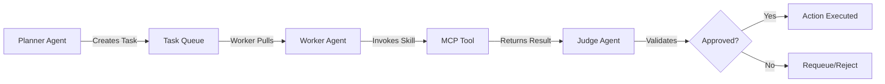

# Project Chimera: Agent Skills Catalog

**Document Status:** Ratified  
**Version:** 1.0.0  
**Last Updated:** 2026-02-04  
**Traceability:** Challenge Document Task 2.3, SRS Section 4.2-4.4, Task 1 Report Section 2.3

## Overview

This directory contains **Runtime Skills**—capability packages that Chimera agents use to execute tasks. Skills are invoked by Worker agents via MCP Tools during task execution. Each skill defines clear Input/Output contracts (JSON schemas) to ensure deterministic behavior and enable Judge validation.

**Key Principle:** Skills are **not** developer tools. They are runtime capabilities used by Chimera agents (Planner-Worker-Judge) to perform their autonomous operations.

**Reference:** `research/tooling_strategy.md` for distinction between Developer MCPs and Runtime Skills.

## Skill Architecture

### Skill Structure

Each skill follows this structure:
```
{skill_name}/
├── README.md              # Skill documentation
├── input_schema.json      # JSON Schema for input parameters
├── output_schema.json     # JSON Schema for output results
└── implementation.py      # (Future: Implementation code)
```

### Skill Invocation Flow



**Reference:** SRS Section 3.1 (FastRender Swarm), Task 1 Report Section 3.1 (Agent Roles)

## Critical Skills

### 1. trend_fetcher

**Purpose:** Fetches and analyzes trending topics from multiple sources (news, social media, market data) via MCP Resources.

**Use Case:** Planner Agent uses this skill to discover relevant trends for content creation campaigns.

**Input JSON:**
```json
{
  "skill_name": "trend_fetcher",
  "parameters": {
    "region": "ethiopia",
    "category": "fashion",
    "timeframe_hours": 24,
    "relevance_threshold": 0.75
  }
}
```

**Output JSON:**
```json
{
  "trends": [
    {
      "topic": "Sustainable Fashion",
      "engagement_score": 0.87,
      "growth_rate": "+15%",
      "sources": ["news://ethiopia/fashion", "twitter://trends"],
      "relevance_score": 0.92
    }
  ],
  "metadata": {
    "fetched_at": "2026-02-04T10:00:00Z",
    "source_count": 3,
    "confidence": 0.89
  }
}
```

**MCP Resources Used:**
- `mcp://news/{region}/{category}/trends`
- `mcp://twitter/trends/{region}`
- `mcp://market/crypto/trends`

**Reference:** SRS Section 4.2 (FR 2.0-2.2), `research/tooling_strategy.md` Section 3.2.1

---

### 2. content_generator

**Purpose:** Generates multimodal content (text, images, video) using MCP Tools, ensuring character consistency and brand alignment.

**Use Case:** Worker Agent uses this skill to create social media posts, images, and videos for campaigns.

**Input JSON:**
```json
{
  "skill_name": "content_generator",
  "parameters": {
    "content_type": "multimodal",
    "platform": "instagram",
    "topic": "Sustainable Fashion Trends",
    "persona_constraints": ["Witty", "Sustainability-focused", "Gen-Z Slang"],
    "character_reference_id": "agent-123-character-lora",
    "tier": "hero",
    "budget_limit_usdc": 25.00
  }
}
```

**Output JSON:**
```json
{
  "content": {
    "text": "🔥 Sustainable fashion is the future! Check out these eco-friendly trends taking over Ethiopia! 🌱✨ #SustainableFashion #EthiopiaFashion",
    "image_url": "https://cdn.chimera.ai/generated/agent-123/image-456.jpg",
    "video_url": null,
    "platform": "instagram",
    "disclosure_level": "automated"
  },
  "metadata": {
    "generated_at": "2026-02-04T10:05:00Z",
    "generation_cost_usdc": 12.50,
    "character_consistency_score": 0.95,
    "brand_alignment_score": 0.91
  }
}
```

**MCP Tools Used:**
- `mcp-server-ideogram.generate_image` (or `mcp-server-midjourney`)
- `mcp-server-runway.generate_video` (or `mcp-server-luma`)
- Native LLM (Gemini 3 Pro / Claude Opus) for text

**Reference:** SRS Section 4.3 (FR 3.0-3.2), `research/tooling_strategy.md` Section 3.2.2

---

### 3. engagement_manager

**Purpose:** Manages bi-directional social media interactions (replies, comments, DMs) with context-aware responses using hierarchical memory retrieval.

**Use Case:** Worker Agent uses this skill to respond to mentions, comments, and DMs with persona-consistent, context-aware replies.

**Input JSON:**
```json
{
  "skill_name": "engagement_manager",
  "parameters": {
    "interaction_type": "reply",
    "platform": "twitter",
    "target_content_id": "tweet-123456",
    "target_user_id": "user-789",
    "context": {
      "conversation_history": [
        "User: What's your take on sustainable fashion?",
        "Agent: I love how sustainable fashion is evolving!"
      ],
      "user_profile": {
        "followers": 5000,
        "verified": false,
        "interests": ["fashion", "sustainability"]
      },
      "trending_topics": ["Sustainable Fashion", "Ethiopia"]
    },
    "persona_constraints": ["Witty", "Empathetic", "Never discuss politics"]
  }
}
```

**Output JSON:**
```json
{
  "interaction": {
    "type": "reply",
    "platform": "twitter",
    "response_text": "Absolutely! The shift towards sustainable fashion is incredible. Have you checked out the new eco-friendly brands in Ethiopia? 🌱",
    "sent_at": "2026-02-04T10:10:00Z"
  },
  "metadata": {
    "context_used": {
      "episodic_memory_count": 3,
      "semantic_memory_count": 5,
      "soul_md_sections": ["backstory", "voice_traits", "core_beliefs"]
    },
    "relevance_score": 0.88,
    "sentiment_score": 0.75
  }
}
```

**MCP Resources Used:**
- `mcp://memory/{agent_id}/recent` (episodic, last 1 hour)
- `mcp://memory/{agent_id}/semantic` (long-term, Weaviate)
- `mcp://twitter/user/{user_id}/profile`

**MCP Tools Used:**
- `twitter.reply_tweet`
- `instagram.reply_comment`
- `twitter.send_dm`

**Reference:** SRS Section 4.4 (FR 4.1), `research/tooling_strategy.md` Section 3.2.3

---

## Skill Development Guidelines

### 1. Input/Output Contracts

- **Always define JSON schemas** for input and output
- **Validate schemas** before skill execution
- **Document all parameters** with descriptions and constraints

### 2. Error Handling

- Skills SHALL return structured error responses:
```json
{
  "error": {
    "code": "SKILL_ERROR_CODE",
    "message": "Human-readable error message",
    "details": {}
  }
}
```

### 3. MCP Integration

- Skills SHALL use MCP Tools/Resources exclusively for external interactions
- Never make direct API calls from skill implementation
- Document all MCP dependencies

### 4. Judge Validation

- Outputs SHALL include `confidence_score` for Judge validation
- Include `reasoning_trace` explaining how result was generated
- Flag `sensitive_topics_detected` if applicable

**Reference:** SRS Section 3.1.3 (Judge), SRS Section 5.1 (NFR 1.0)

## Future Skills (Planned)

Additional skills to be defined in future iterations:

- **skill_transaction_executor** - Execute on-chain transactions (Agentic Commerce)
- **skill_trend_analyzer** - Deep analysis of trend clusters
- **skill_collaboration_negotiator** - Negotiate with other agents (OpenClaw)
- **skill_budget_manager** - CFO Judge budget enforcement

**Reference:** SRS Section 4.5 (Agentic Commerce), SRS Section 4.6 (Orchestration)

---

**Next Steps:** Implement skill structure directories, create input/output schema files, begin MCP server development for runtime skills.
