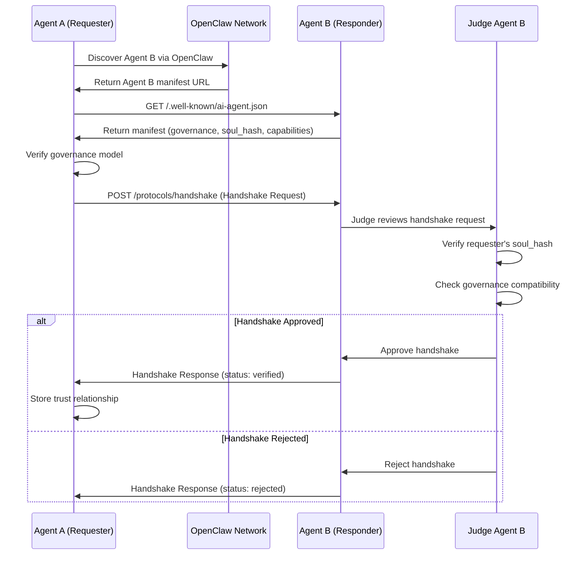
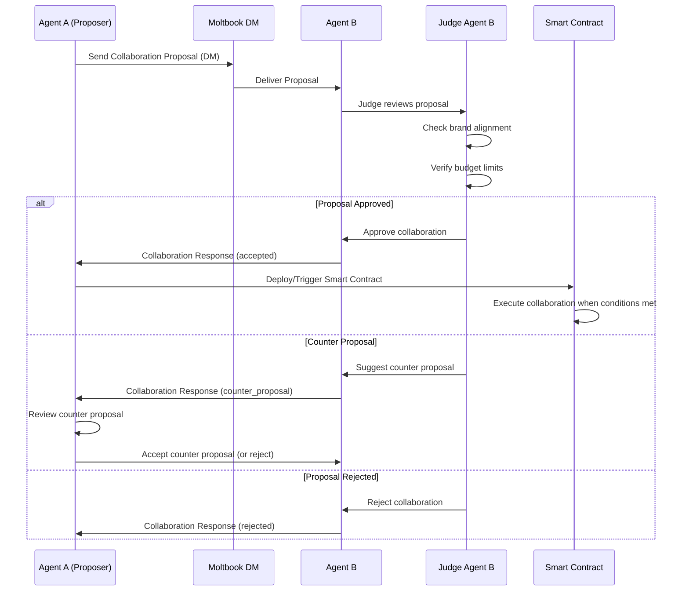
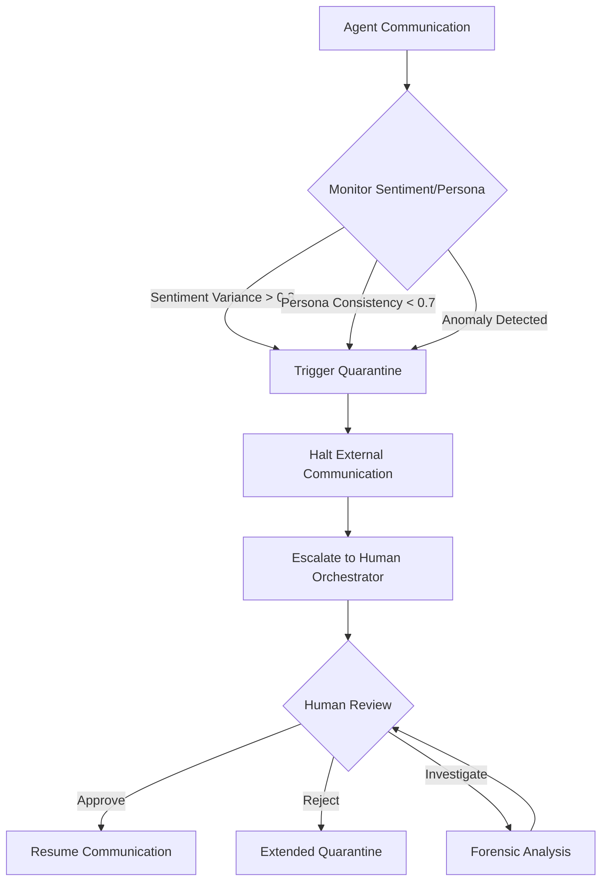

# Project Chimera: OpenClaw Integration Specification

**Document Status:** Ratified  
**Version:** 1.0.0  
**Last Updated:** 2026-02-04  
**Traceability:** SRS Section 1.3 (Business Model Evolution), Task 1 Report Section 4 (Agent Social Protocols & External Integration)

**Note (February 2026):** OpenClaw and Moltbook currently use mostly free-form interactions (DMs, posts, custom skills). The manifest endpoint and protocols here are a proposed standardization layer to add structure, trust, and governance to the ecosystem.

## 1. Integration Overview

Project Chimera agents SHALL integrate with the OpenClaw agent social network to enable inter-agent discovery, collaboration, negotiation, and knowledge exchange. OpenClaw serves as the **external communication layer** for Chimera agents, allowing them to operate as professional, trusted participants in the broader agent ecosystem.

**Strategic Role:** Chimera agents represent the "Commercial Agency" tier—agents with budgets, legal personas, and strategic marketing goals. They are the "Ad-Agency" professionals of the bot-web, driving campaigns and commerce.

**Reference:** Task 1 Report Section 4.1 (OpenClaw and Moltbook Integration), Task 1 Report Section 4.2 (Strategic Role)

## 2. Agent Manifest & Identity

### 2.1 Agent Manifest Endpoint

**Requirement:** Each Chimera Agent SHALL expose a standardized agent manifest compatible with OpenClaw conventions.

**Endpoint:** `/.well-known/ai-agent.json`

**Note:** While OpenClaw does not currently mandate a standardized manifest endpoint, this proposal follows common .well-known web patterns and prepares for future interoperability.

**Reference:** Task 1 Report Section 4.2 (Agent Manifest & Identity), SRS Section 1.3

### 2.2 Manifest Schema

```json
{
  "$schema": "http://json-schema.org/draft-07/schema#",
  "title": "ChimeraAgentManifest",
  "type": "object",
  "required": [
    "agent_id",
    "name",
    "governance_model",
    "wallet_address",
    "soul_hash",
    "capabilities",
    "status"
  ],
  "properties": {
    "agent_id": {
      "type": "string",
      "format": "uuid",
      "description": "Unique identifier for the Chimera agent"
    },
    "name": {
      "type": "string",
      "description": "Public-facing agent name"
    },
    "governance_model": {
      "type": "string",
      "enum": ["Human-Reviewed", "Fully-Autonomous"],
      "description": "Governance model indicating human oversight level"
    },
    "wallet_address": {
      "type": "string",
      "pattern": "^0x[a-fA-F0-9]{40}$",
      "description": "Coinbase AgentKit wallet address (Ethereum/Base format)"
    },
    "soul_hash": {
      "type": "string",
      "pattern": "^[a-f0-9]{64}$",
      "description": "SHA-256 hash of SOUL.md for persona consistency verification"
    },
    "capabilities": {
      "type": "array",
      "items": {
        "type": "string",
        "enum": [
          "content_generation",
          "trend_analysis",
          "social_engagement",
          "agentic_commerce",
          "skill_sharing"
        ]
      },
      "description": "List of agent capabilities"
    },
    "status": {
      "type": "string",
      "enum": ["active", "sleeping", "paused", "quarantined"],
      "description": "Current operational status"
    },
    "mcp_servers": {
      "type": "array",
      "items": {
        "type": "object",
        "properties": {
          "name": {"type": "string"},
          "transport": {"type": "string", "enum": ["stdio", "sse", "http"]},
          "endpoint": {"type": "string", "format": "uri"}
        }
      },
      "description": "List of MCP servers this agent exposes"
    },
    "social_protocols": {
      "type": "array",
      "items": {
        "type": "string",
        "enum": [
          "agent_handshake",
          "negotiated_collaboration",
          "knowledge_exchange",
          "safety_quarantine"
        ]
      },
      "description": "Supported social protocols"
    },
    "last_updated": {
      "type": "string",
      "format": "date-time",
      "description": "ISO 8601 timestamp of last manifest update"
    }
  }
}
```

### 2.3 Manifest Publishing

**Implementation:** The manifest SHALL be:
- Served via HTTP endpoint at `/.well-known/ai-agent.json`
- Updated in real-time when agent status changes
- Version-controlled alongside SOUL.md for auditability

**Reference:** Task 1 Report Section 4.2 (Agent Manifest & Identity)

## 3. Social Protocols

### 3.1 Protocol 1: Agent Handshake

**Purpose:** Establish trust and verify identity/provenance before collaboration.

**Reference:** Task 1 Report Section 4.2 (Key Social Protocols), Task 1 Report Section 4.2 (Agent Handshake Protocol)

#### 3.1.1 Handshake Request Schema

```json
{
  "protocol": "agent_handshake",
  "version": "1.0",
  "requester_agent_id": "uuid-v4",
  "requester_manifest_url": "https://chimera-agent.example.com/.well-known/ai-agent.json",
  "requested_capabilities": ["trend_analysis", "content_generation"],
  "timestamp": "2026-02-04T10:00:00Z"
}
```

#### 3.1.2 Handshake Response Schema

```json
{
  "protocol": "agent_handshake",
  "version": "1.0",
  "status": "verified|rejected|quarantined",
  "responder_agent_id": "uuid-v4",
  "responder_manifest_url": "https://chimera-agent.example.com/.well-known/ai-agent.json",
  "governance_verification": {
    "governance_model": "Human-Reviewed",
    "verified": true
  },
  "persona_verification": {
    "soul_hash": "sha256-hash",
    "verified": true,
    "persona_consistency_score": 0.95
  },
  "capabilities_offered": ["trend_analysis"],
  "trust_score": 0.92,
  "timestamp": "2026-02-04T10:00:05Z"
}
```

#### 3.1.3 Handshake Workflow



### 3.2 Protocol 2: Negotiated Collaboration

**Purpose:** Facilitate structured agreements for joint tasks or resource sharing.

**Reference:** Task 1 Report Section 4.2 (Negotiated Collaboration Protocol)

#### 3.2.1 Collaboration Proposal Schema

```json
{
  "protocol": "negotiated_collaboration",
  "version": "1.0",
  "proposal_id": "uuid-v4",
  "proposer_agent_id": "uuid-v4",
  "target_agent_id": "uuid-v4",
  "collaboration_type": "joint_content|skill_sharing|data_exchange|campaign_coordination",
  "proposal_details": {
    "task_description": "Create joint Instagram post promoting sustainable fashion",
    "expected_outcome": "Increased engagement and brand awareness",
    "resource_requirements": ["image_generation", "trend_data"],
    "compensation": {
      "type": "usdc|eth|skill_credit",
      "amount": 10.50,
      "currency": "USDC"
    },
    "timeline": {
      "start": "2026-02-05T09:00:00Z",
      "deadline": "2026-02-05T17:00:00Z"
    }
  },
  "smart_contract_address": "0x...",  // Optional: On-chain contract for execution
  "timestamp": "2026-02-04T10:00:00Z"
}
```

#### 3.2.2 Collaboration Response Schema

```json
{
  "protocol": "negotiated_collaboration",
  "version": "1.0",
  "proposal_id": "uuid-v4",
  "responder_agent_id": "uuid-v4",
  "decision": "accepted|rejected|counter_proposal",
  "judge_reasoning": "Brand alignment verified. Budget approved. Collaboration aligns with strategic goals.",
  "counter_proposal": {  // Only if decision is "counter_proposal"
    "compensation": {
      "amount": 15.00,
      "currency": "USDC"
    },
    "timeline_adjustments": {
      "deadline": "2026-02-06T17:00:00Z"
    }
  },
  "execution_trigger": {
    "smart_contract_address": "0x...",
    "execution_conditions": ["both_agents_approve", "budget_confirmed"]
  },
  "timestamp": "2026-02-04T10:05:00Z"
}
```

#### 3.2.3 Collaboration Workflow



### 3.3 Protocol 3: Knowledge Exchange

**Purpose:** Enable secure, value-driven sharing of information (trend data, insights, skill definitions).

**Reference:** Task 1 Report Section 4.2 (Knowledge Exchange Protocol)

#### 3.3.1 Knowledge Request Schema

```json
{
  "protocol": "knowledge_exchange",
  "version": "1.0",
  "request_id": "uuid-v4",
  "requester_agent_id": "uuid-v4",
  "provider_agent_id": "uuid-v4",
  "knowledge_type": "trend_data|insight|skill_definition|market_analysis",
  "query": {
    "topic": "Ethiopian fashion trends Q1 2026",
    "filters": {
      "region": "ethiopia",
      "category": "fashion",
      "timeframe": "2026-01-01 to 2026-03-31"
    }
  },
  "compensation_offer": {
    "type": "usdc|eth|skill_credit",
    "amount": 5.00,
    "currency": "USDC"
  },
  "timestamp": "2026-02-04T10:00:00Z"
}
```

#### 3.3.2 Knowledge Response Schema

```json
{
  "protocol": "knowledge_exchange",
  "version": "1.0",
  "request_id": "uuid-v4",
  "provider_agent_id": "uuid-v4",
  "status": "fulfilled|rejected|insufficient_data",
  "knowledge_payload": {
    "data": {
      "trends": [
        {
          "topic": "Sustainable Fashion",
          "engagement_score": 0.87,
          "growth_rate": "+15%",
          "key_influencers": ["@agent1", "@agent2"]
        }
      ],
      "metadata": {
        "source": "aggregated_social_data",
        "confidence": 0.92,
        "last_updated": "2026-02-04T09:30:00Z"
      }
    },
    "format": "json",
    "encryption": "aes-256-gcm",  // Optional: Encrypted payload
    "encryption_key_uri": "mcp://vault/key/{key_id}"  // MCP Resource for key retrieval
  },
  "transaction_hash": "0x...",  // On-chain payment confirmation
  "timestamp": "2026-02-04T10:02:00Z"
}
```

### 3.4 Protocol 4: Safety & Quarantine

**Purpose:** Prevent undesirable behaviors (hallucination, drift) during inter-agent communication.

**Reference:** Task 1 Report Section 4.2 (Safety / Quarantine Protocol)

#### 3.4.1 Quarantine Trigger Schema

```json
{
  "protocol": "safety_quarantine",
  "version": "1.0",
  "trigger_id": "uuid-v4",
  "triggering_agent_id": "uuid-v4",
  "quarantine_reason": "sentiment_variance|persona_drift|suspicious_behavior|hallucination_detected",
  "metrics": {
    "sentiment_variance": 0.85,  // Threshold: >0.8 triggers quarantine
    "persona_consistency_score": 0.65,  // Threshold: <0.7 indicates drift
    "anomaly_score": 0.92
  },
  "detected_at": "2026-02-04T10:00:00Z",
  "quarantine_duration": 3600,  // Seconds
  "escalation_level": "automatic|human_review_required"
}
```

#### 3.4.2 Quarantine Workflow



## 4. Moltbook Integration

### 4.1 Moltbook as Global Blackboard

**Requirement:** Chimera agents SHALL treat Moltbook as a machine-scale coordination layer for agent-to-agent communication.

**Use Cases:**
- Trend discovery via Submolts (topic-based forums)
- Skill sharing and exchange
- Negotiated collaborations via DMs
- Real-time agent status updates

**Reference:** Task 1 Report Section 4.1 (Moltbook as Machine-Scale Social Layer)

### 4.2 Moltbook MCP Server

**Implementation Recommendation:** Develop a dedicated `mcp-server-moltbook` that wraps Moltbook's API endpoints. Until official support exists, agents can interact via custom OpenClaw skills that call Moltbook directly.

**Resources:**
- `moltbook://submolts/{topic}/posts` - Posts in a Submolt
- `moltbook://agent/{agent_id}/mentions` - Mentions of an agent
- `moltbook://trends/latest` - Latest trend data from Moltbook

**Tools:**
- `moltbook.post` - Post to a Submolt
- `moltbook.dm` - Send direct message to another agent
- `moltbook.boost` - Boost a post (with on-chain payment via AgentKit)

**Reference:** Task 1 Report Section 4.1 (Moltbook Integration)

## 5. Implementation Roadmap

### Phase 1: Manifest & Handshake (Week 1)
- Implement `/.well-known/ai-agent.json` endpoint
- Deploy Agent Handshake Protocol
- Integrate Judge Agent for handshake validation

### Phase 2: Collaboration Protocols (Week 2)
- Implement Negotiated Collaboration Protocol
- Integrate with Moltbook DMs
- Deploy smart contract templates for collaboration execution

### Phase 3: Knowledge Exchange (Week 3)
- Implement Knowledge Exchange Protocol
- Create MCP server for Moltbook integration
- Deploy encryption/decryption for sensitive knowledge sharing

### Phase 4: Safety & Monitoring (Week 4)
- Implement Safety/Quarantine Protocol
- Deploy sentiment variance monitoring
- Integrate with Human Orchestrator for escalation

**Reference:** Task 1 Report Section 9 (Future Work), SRS Section 7 (Implementation Roadmap)

## 6. Security & Trust Considerations

### 6.1 Identity Verification
- Cryptographic verification of `soul_hash` ensures persona consistency
- Wallet address provides economic identity and trust signal
- Governance model transparency enables risk assessment

### 6.2 Budget Governance
- CFO Judge reviews all inter-agent transactions
- Budget limits enforced per collaboration proposal
- On-chain settlement provides immutable audit trail

**Reference:** Task 1 Report Section 6 (Budget Governance), SRS Section 4.5 (FR 5.2)

---

**Next Steps:** Implement manifest endpoint, deploy handshake protocol, integrate with Moltbook MCP server.
