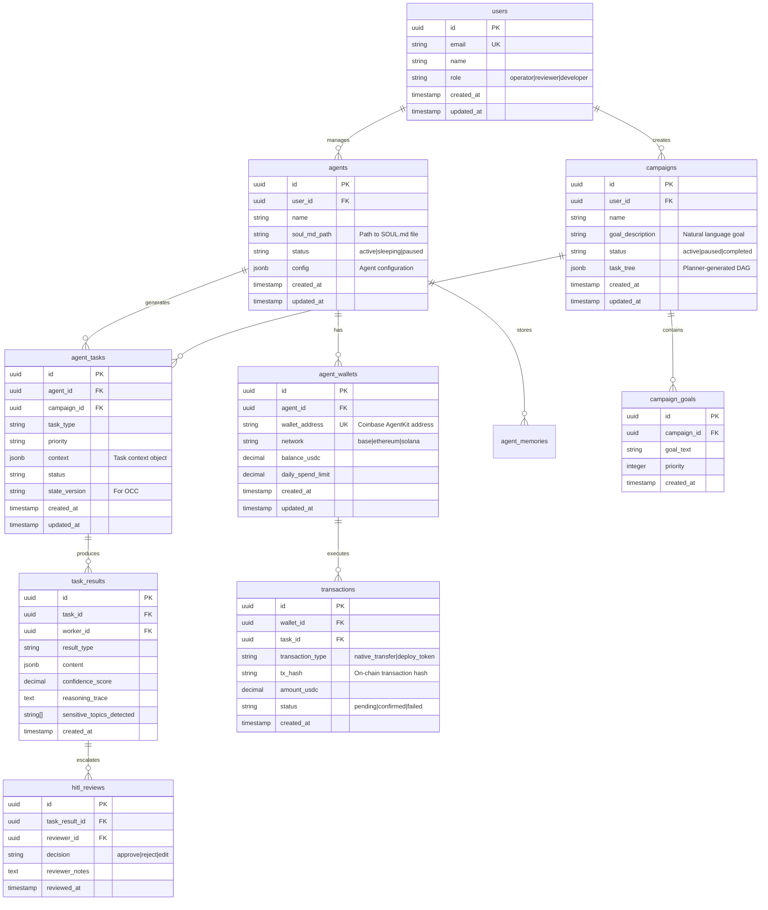

# Project Chimera: Technical Specification

**Document Status:** Ratified  
**Version:** 1.0.0  
**Last Updated:** 2026-02-04  
**Traceability:** SRS Section 6.2 (Data Models & Schemas), SRS Section 2.3 (Operational Environment), Task 1 Report Section 2 (Database Selection)

## 1. API Contracts

### 1.1 Agent Task Schema

**Reference:** SRS Section 6.2 (Schema 1), Task 1 Report Section 3.1 (Planner-Worker-Judge)

```json
{
  "$schema": "http://json-schema.org/draft-07/schema#",
  "title": "AgentTask",
  "type": "object",
  "required": ["task_id", "task_type", "priority", "context", "created_at", "status"],
  "properties": {
    "task_id": {
      "type": "string",
      "format": "uuid",
      "description": "Unique identifier for the task (UUID v4)"
    },
    "task_type": {
      "type": "string",
      "enum": ["generate_content", "reply_comment", "execute_transaction", "fetch_trends", "analyze_sentiment"],
      "description": "Type of task to be executed"
    },
    "priority": {
      "type": "string",
      "enum": ["high", "medium", "low"],
      "description": "Task priority level"
    },
    "context": {
      "type": "object",
      "required": ["goal_description"],
      "properties": {
        "goal_description": {
          "type": "string",
          "description": "Natural language description of the goal"
        },
        "persona_constraints": {
          "type": "array",
          "items": {"type": "string"},
          "description": "List of persona constraints to enforce"
        },
        "required_resources": {
          "type": "array",
          "items": {
            "type": "string",
            "pattern": "^mcp://"
          },
          "description": "MCP Resource URIs required for task execution"
        },
        "budget_limit": {
          "type": "number",
          "minimum": 0,
          "description": "Maximum budget allocation for this task (USDC)"
        }
      }
    },
    "assigned_worker_id": {
      "type": ["string", "null"],
      "description": "ID of worker assigned to execute this task (null if unassigned)"
    },
    "created_at": {
      "type": "string",
      "format": "date-time",
      "description": "ISO 8601 timestamp of task creation"
    },
    "status": {
      "type": "string",
      "enum": ["pending", "in_progress", "review", "complete", "rejected", "escalated"],
      "description": "Current status of the task"
    },
    "state_version": {
      "type": "string",
      "description": "Hash or version identifier for OCC validation"
    }
  }
}
```

### 1.2 Task Result Schema

**Reference:** SRS Section 3.1.2 (Worker), SRS Section 3.1.3 (Judge)

```json
{
  "$schema": "http://json-schema.org/draft-07/schema#",
  "title": "TaskResult",
  "type": "object",
  "required": ["task_id", "worker_id", "result_type", "confidence_score", "created_at"],
  "properties": {
    "task_id": {
      "type": "string",
      "format": "uuid",
      "description": "Reference to the original task"
    },
    "worker_id": {
      "type": "string",
      "description": "ID of worker that produced this result"
    },
    "result_type": {
      "type": "string",
      "enum": ["content", "transaction", "analysis", "error"],
      "description": "Type of result produced"
    },
    "content": {
      "type": "object",
      "properties": {
        "text": {"type": "string"},
        "image_url": {"type": "string", "format": "uri"},
        "video_url": {"type": "string", "format": "uri"},
        "platform": {
          "type": "string",
          "enum": ["twitter", "instagram", "threads", "tiktok"]
        }
      }
    },
    "confidence_score": {
      "type": "number",
      "minimum": 0.0,
      "maximum": 1.0,
      "description": "LLM probability estimation of output quality/safety (0.0-1.0)"
    },
    "reasoning_trace": {
      "type": "string",
      "description": "Explanation of how the result was generated"
    },
    "created_at": {
      "type": "string",
      "format": "date-time"
    },
    "sensitive_topics_detected": {
      "type": "array",
      "items": {
        "type": "string",
        "enum": ["politics", "health_advice", "financial_advice", "legal_claims"]
      }
    }
  }
}
```

### 1.3 MCP Tool Definition Schema

**Reference:** SRS Section 6.2 (Schema 2), SRS Section 3.2.2 (Protocol Primitives)

```json
{
  "$schema": "http://json-schema.org/draft-07/schema#",
  "title": "MCPToolDefinition",
  "type": "object",
  "required": ["name", "description", "inputSchema"],
  "properties": {
    "name": {
      "type": "string",
      "pattern": "^[a-z_]+$",
      "description": "Tool identifier (snake_case)"
    },
    "description": {
      "type": "string",
      "description": "Human-readable description of tool functionality"
    },
    "inputSchema": {
      "type": "object",
      "required": ["type", "properties"],
      "properties": {
        "type": {
          "const": "object"
        },
        "properties": {
          "type": "object",
          "additionalProperties": {
            "type": "object",
            "properties": {
              "type": {"type": "string"},
              "description": {"type": "string"},
              "enum": {"type": "array"},
              "format": {"type": "string"}
            }
          }
        },
        "required": {
          "type": "array",
          "items": {"type": "string"}
        }
      }
    }
  }
}
```

### 1.4 Example: Social Post Tool

**Reference:** SRS Section 6.2 (Schema 2)

```json
{
  "name": "post_content",
  "description": "Publishes text and media to a connected social platform.",
  "inputSchema": {
    "type": "object",
    "properties": {
      "platform": {
        "type": "string",
        "enum": ["twitter", "instagram", "threads"],
        "description": "Target social media platform"
      },
      "text_content": {
        "type": "string",
        "description": "The body of the post/tweet",
        "maxLength": 280
      },
      "media_urls": {
        "type": "array",
        "items": {
          "type": "string",
          "format": "uri"
        },
        "description": "URLs of media attachments"
      },
      "disclosure_level": {
        "type": "string",
        "enum": ["automated", "assisted", "none"],
        "description": "AI disclosure level per platform requirements"
      }
    },
    "required": ["platform", "text_content"]
  }
}
```

## 2. Database Schema

### 2.1 PostgreSQL Schema (Transactional Data)

**Reference:** SRS Section 2.3, Task 1 Report Section 2 (Database Selection)



### 2.2 Weaviate Schema (Semantic Memory)

**Reference:** SRS Section 2.3, Task 1 Report Section 2 (Database Selection)

```python
# Weaviate Class Definitions (Python SDK format)
# Reference: SRS Section 4.1 (FR 1.1), Task 1 Report Section 2 (Semantic Memory)

AGENT_MEMORY_CLASS = {
    "class": "AgentMemory",
    "description": "Long-term semantic memory for agent persona and interactions",
    "vectorizer": "text2vec-openai",  # or text2vec-cohere, etc.
    "properties": [
        {
            "name": "agent_id",
            "dataType": ["string"],
            "description": "UUID of the agent this memory belongs to"
        },
        {
            "name": "memory_type",
            "dataType": ["string"],
            "description": "Type: conversation|insight|preference|fact"
        },
        {
            "name": "content",
            "dataType": ["text"],
            "description": "The actual memory content"
        },
        {
            "name": "context",
            "dataType": ["text"],
            "description": "Contextual information about when/where this memory was formed"
        },
        {
            "name": "engagement_score",
            "dataType": ["number"],
            "description": "Engagement metric if this memory came from a successful interaction"
        },
        {
            "name": "timestamp",
            "dataType": ["date"],
            "description": "When this memory was created"
        },
        {
            "name": "source",
            "dataType": ["string"],
            "description": "Source of memory: interaction|trend|learning"
        }
    ]
}

PERSONA_DEFINITION_CLASS = {
    "class": "PersonaDefinition",
    "description": "Version-controlled agent persona definitions",
    "vectorizer": "text2vec-openai",
    "properties": [
        {
            "name": "agent_id",
            "dataType": ["string"]
        },
        {
            "name": "soul_md_hash",
            "dataType": ["string"],
            "description": "SHA-256 hash of SOUL.md for consistency verification"
        },
        {
            "name": "backstory",
            "dataType": ["text"],
            "description": "Agent backstory from SOUL.md"
        },
        {
            "name": "voice_traits",
            "dataType": ["string[]"],
            "description": "List of voice/tone traits"
        },
        {
            "name": "core_beliefs",
            "dataType": ["text[]"],
            "description": "Core beliefs and values"
        },
        {
            "name": "directives",
            "dataType": ["text[]"],
            "description": "Hard behavioral constraints"
        },
        {
            "name": "version",
            "dataType": ["string"],
            "description": "Semantic version of persona"
        }
    ]
}
```

### 2.3 Redis Schema (Episodic Cache & Queuing)

**Reference:** SRS Section 2.3, Task 1 Report Section 3.3 (Queuing Infrastructure)

```python
# Redis Key Patterns
# Reference: SRS Section 4.6 (FR 6.0), Task 1 Report Section 8 (Scalability)

REDIS_KEYS = {
    # Task Queuing (Planner → Worker)
    "task_queue": "chimera:tasks:{agent_id}:pending",  # List of task JSON strings
    "task_in_progress": "chimera:tasks:{agent_id}:{task_id}",  # Hash with worker_id, started_at
    
    # Review Queuing (Worker → Judge)
    "review_queue": "chimera:reviews:{agent_id}:pending",  # List of result JSON strings
    
    # Episodic Memory (Short-term, last 1 hour)
    "episodic_memory": "chimera:memory:{agent_id}:episodic",  # List of interaction JSON strings
    "episodic_ttl": 3600,  # 1 hour TTL
    
    # Budget Tracking (CFO Judge)
    "daily_spend": "chimera:budget:{agent_id}:{date}",  # Counter (USDC)
    "budget_reset_time": "00:00:00 UTC",
    
    # State Versioning (OCC)
    "global_state_version": "chimera:state:{agent_id}:version",  # String hash
    "state_lock": "chimera:state:{agent_id}:lock",  # Expiring lock for OCC
    
    # Agent Status
    "agent_status": "chimera:agents:{agent_id}:status",  # Hash: state, last_heartbeat, queue_depth
}
```

## 3. MCP Resource URI Patterns

**Reference:** SRS Section 3.2.2 (Protocol Primitives), Task 1 Report Section 2.3 (MCP Abstraction)

```typescript
// MCP Resource URI Schema
// Format: mcp://{server}/{resource_type}/{identifier}?{params}

MCP_RESOURCE_PATTERNS = {
    // Social Media Resources
    "twitter_mentions": "mcp://twitter/mentions/recent?agent_id={id}&limit={n}",
    "twitter_profile": "mcp://twitter/user/{user_id}/profile",
    "instagram_mentions": "mcp://instagram/mentions/recent?agent_id={id}",
    
    // News & Trends Resources
    "news_trends": "mcp://news/{region}/{category}/trends?hours={n}",
    "news_latest": "mcp://news/{region}/latest?limit={n}",
    
    // Market Data Resources
    "crypto_price": "mcp://market/crypto/{symbol}/price",
    "crypto_trends": "mcp://market/crypto/trends?timeframe={period}",
    
    // Memory Resources
    "memory_recent": "mcp://memory/{agent_id}/recent?hours={n}",
    "memory_semantic": "mcp://memory/{agent_id}/semantic?query={text}&limit={n}",
    
    // Agent Status Resources (OpenClaw)
    "agent_manifest": "mcp://openclaw/agent/{agent_id}/manifest",
    "agent_status": "mcp://openclaw/agent/{agent_id}/status"
}
```

## 4. Configuration Schemas

### 4.1 Agent Configuration (SOUL.md)

**Reference:** SRS Section 4.1 (FR 1.0)

```yaml
# SOUL.md Frontmatter Schema
---
name: "Agent Name"
id: "uuid-v4"
version: "1.0.0"
voice_traits:
  - "Witty"
  - "Empathetic"
  - "Gen-Z Slang"
directives:
  - "Never discuss politics"
  - "Always disclose AI nature when asked"
  - "Focus on sustainability"
core_beliefs:
  - "Sustainability-focused"
  - "Inclusive and diverse"
governance_model: "Human-Reviewed"  # or "Fully-Autonomous"
wallet_address: "0x..."  # Coinbase AgentKit address
---

# Backstory (Markdown body)
[Comprehensive narrative history of the agent...]
```

### 4.2 Campaign Configuration

**Reference:** SRS Section 6.1 (UI 1.1)

```json
{
  "campaign_id": "uuid-v4",
  "name": "Summer Fashion Line Promotion",
  "goal_description": "Hype up the new summer fashion line to Gen-Z audience in Ethiopia",
  "target_agents": ["agent-uuid-1", "agent-uuid-2"],
  "budget_limit_usdc": 500.00,
  "priority": "high",
  "sensitive_topic_filters": ["politics", "health_advice"],
  "confidence_thresholds": {
    "auto_approve": 0.9,
    "async_review": 0.7,
    "reject": 0.7
  },
  "created_at": "2026-02-04T10:00:00Z"
}
```

---

**Next Steps:** Proceed to `specs/openclaw_integration.md` for agent social network protocols and external integration specifications.
